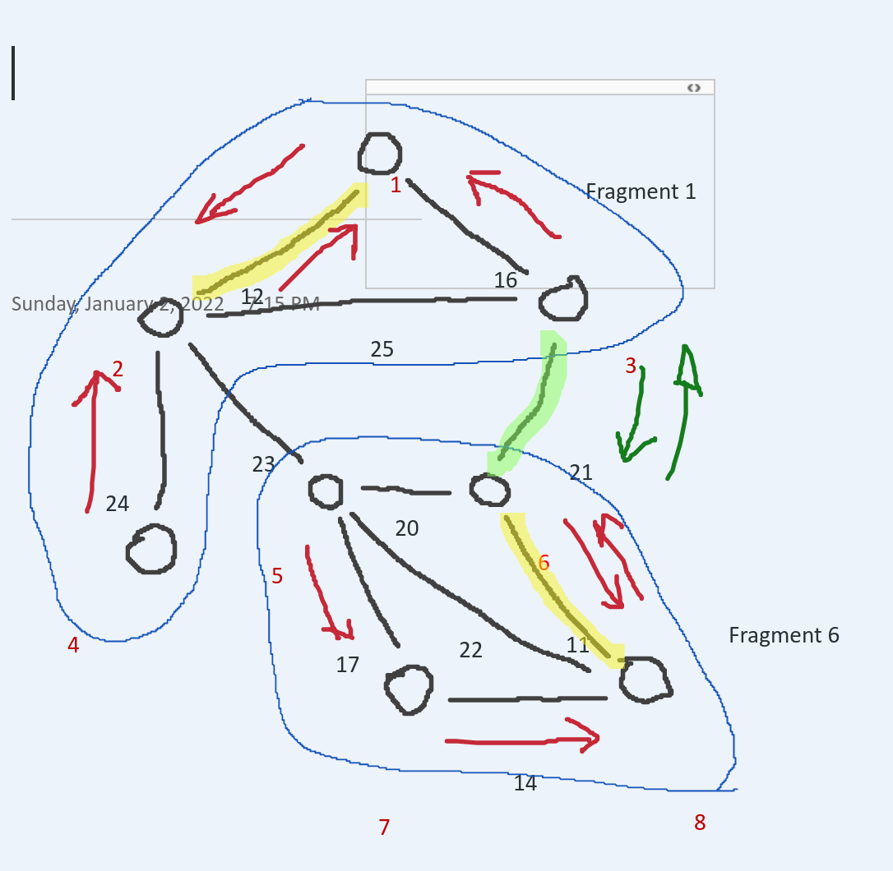

# [ParaDis] Distributed minimum spanning tree

## Build and Run
```
go mod init github.com/go-yaml/yaml
go get gopkg.in/yaml.v2

go build
go run main.go server.go
```

## Description

The algorithm follows the GHS phases:

1. CONNECT

*Connect to the least weighed neighbor, and determine which node is the root of the MST.*

2. NEW_FRAGMENT

*The root propagates the fragments ID to its children. Every nodes updates its parent node.*

3. TEST

*Every nodes send a test message to every neighbors.*

4. ACCEPT/REJECT

*Every nodes responds with an ACCEPT message in case they are in a different fragment, otherwise REJECT.*

5. REPORT

*The nodes without any children starts to report the least weighed neighbor that is in a different fragment. Every node propagates to the root node only the least weighed path reported by a child or self.*

6. MERGE

*The root sends a merge request to the least weighed path reported by a child or self. The merge message is sent to every child in order for them to determine if the algorithm continues or if there isn't any new merge to performed. An alternative to this implementation detail would be the usage of a timeout.*

*If a new merge occurs, the nodes next to the reported least weighed path CONNECT to each other. The lowest node's ID becomes the new root and send a NEW_FRAGMENT (back to step 2).*

## Test cases


